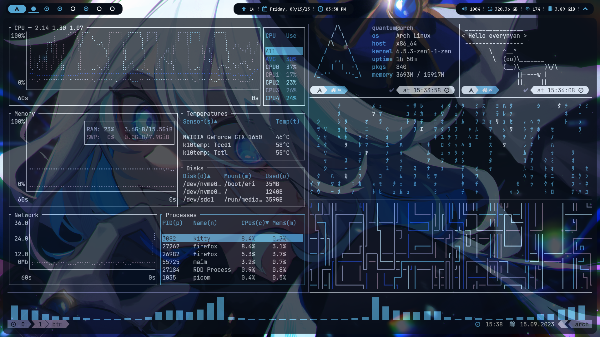

Mi configuración personal para Arch Linux con BSPWM.

### Componentes

- **WM:** [bspwm](https://github.com/baskerville/bspwm)
- **OS:** [Arch Linux](https://archlinux.org)
- **Bar:** [Polybar](https://github.com/polybar/polybar)
- **Terminal:** [kitty](https://github.com/kovidgoyal/kitty)
- **Shell:** [zsh](https://wiki.archlinux.org/index.php/Zsh)
- **Compositor:** [picom Jonaburg fork](https://github.com/jonaburg/picom)
- **File Manager:** [pcmanfm](https://github.com/lxde/pcmanfm)
- **Application Launcher:** [rofi](https://github.com/davatorium/rofi)

## Demo

  

## Documentación

Acerca de los dotfiles y para la resoulcion de problemas visitar: [htts://quantumwavves.github.io](https://quantumwavves.github.io/projects/2023-11-22-dotfiles/)
